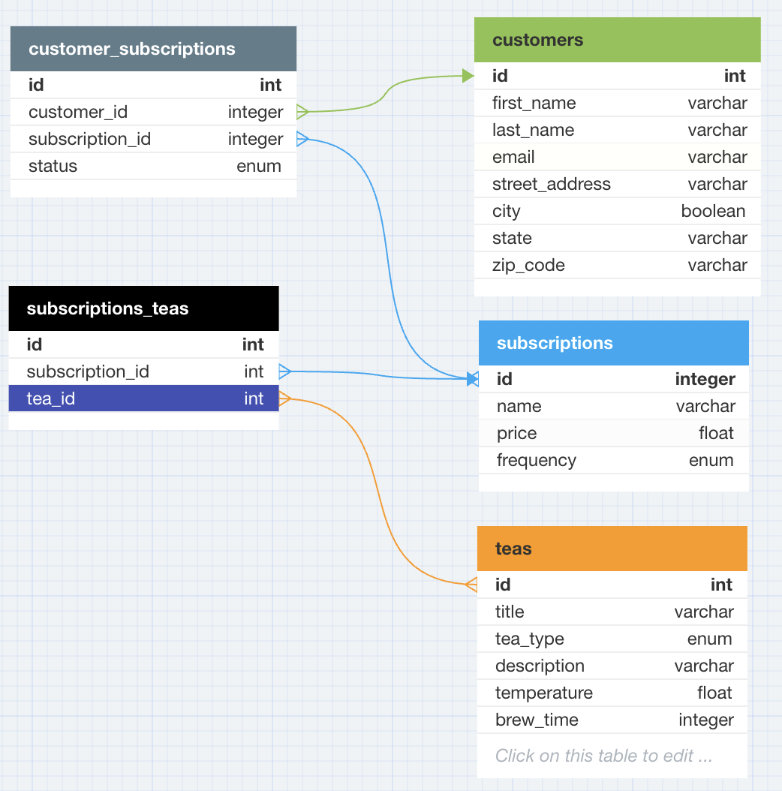

# Tastea Tea API

Tastea Tea is an API which provides a platform built on Rails for managing tea subscriptions. Users can subscribe to tea services, cancel subscriptions, and view a comprehensive list of their active and canceled subscriptions through dedicated endpoints. The API aims for simplicity, emphasizing a strong understanding of Rails, RESTful routes, organized Object-Oriented Programming (OOP) code, Test Driven Development (TDD) practices, and clear documentation. The API models include Tea (with attributes such as Title, Description, Temperature, Brew Time), Customer (including First Name, Last Name, Email, Address), and Subscription (with Title, Price, Status, Frequency).

## Versions
- `Ruby 3.2.2`
- `Rails 7.1.3`

## Set-Up Instructions
- Fork and clone this GitHub Reposistory:
  - [Tastea Tea Repo](https://github.com/ttakahashi1591/tastea_tea)

- Install necessary gems: 
  - `bundle exec install`

- Create, Migrate, & Seed the Database: 
  - `rails db:{create,migrate,seed}`

- Run the tests suite and there should be 34 tests should be passing:
  - `bundle exec rspec`
  - `34 examples, 0 failures`

# Endpoints
## Subscribe a Customer to a new Tastea Tea Subscrption
#### This endpoint creates a row on the CustomerSubscriptions table to associate a customer with their new subscription. Status of the subscription will be set to `active` by default.
**Example Request:**

```
POST "/api/v0/customers/1/subscriptions", params: {subscription_id: 3}
```

**Happy Path**

```
{
  "message": "Successfully subscribed!"
}
```

## Update the status (Cancel or Pause) of a Customer's Subscription
#### This endpoint will update the status of a Customer's subscrition. Subscriptions can be updated to `cancel` or `pause`. 
**Example Request:**

```
PATCH "/api/v0/customers/1/subscriptions/1", params: {status: "cancelled"}
```

**Happy Path**

```
{
  "message": "Subscription Cancelled"

}
```

## Index of all of a Customer's Subscriptions (regardless of subscription `status`)
#### This endpoint will return a list of all of a given customer's subscriptions, including their statuses.

**Example Request:**

```
GET "/api/v0/customers/3/subscriptions" 
```

**Happy Path**

```
{
  "data": [
        {
            "id": "1",
            "type": "subscription",
            "attributes": {
                "name": "Grass Type Pack",
                "price": 15.99,
                "frequency": "Bi-Weekly",
                "status": "active"
            }
        },
        {
            "id": "3",
            "type": "subscription",
            "attributes": {
                "name": "Water Type Pack",
                "price": 22.99,
                "frequency": "Monthly",
                "status": "active"
            }
        },
        {
            "id": "4",
            "type": "subscription",
            "attributes": {
                "name": "Electric Type Pack",
                "price": 19.99,
                "frequency": "Weekly",
                "status": "cancelled"
            }
        }
    ]

}
```

## Tastea Tea Database
 

### Teas
**Stores Data about differnt Tea Blends.**
- Title (name of tea)
- Tea Type (black, blended, chai, green, herbal, matcha, oolong, white)
- Description
- Temperature (F)
- Brew Time

### Customers
- First Name
- Last Name
- Email
- Street Address
- City
- State
- Zip Code

### Subscriptions
- Name
- Price
- Frequency (ie: Weekly, Bi-Weekly, Monthly)

### SubscriptionTeas
- `subscription_id`
- `tea_id`

### CustomerSubscriptions
- `subscription_id`
- `customer_id`
- Status (Default set to: `active`, options for: `pause` and `cancel`)

# Future Features & Updates
- Set-up CRUD fucntioning for Teas, Customers, and Subscriptions


